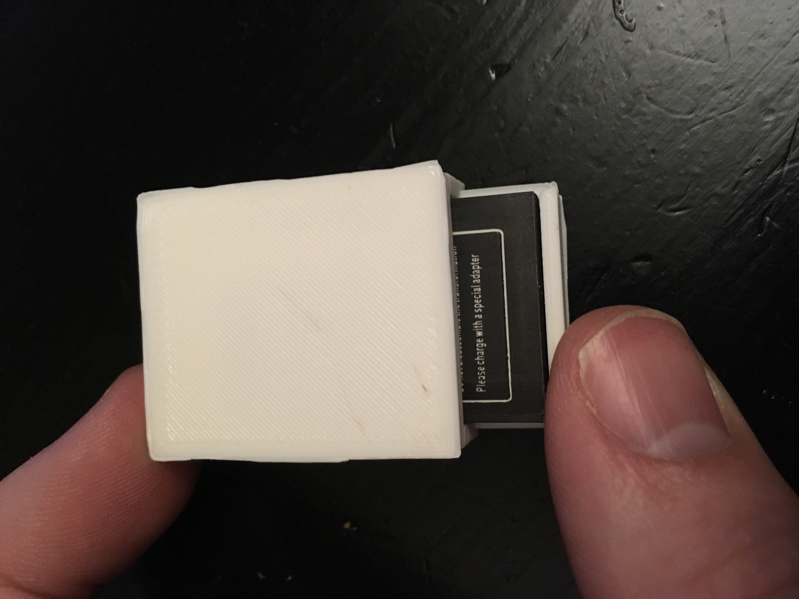
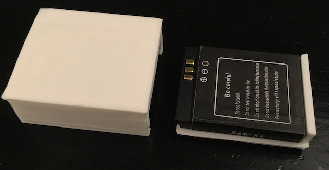
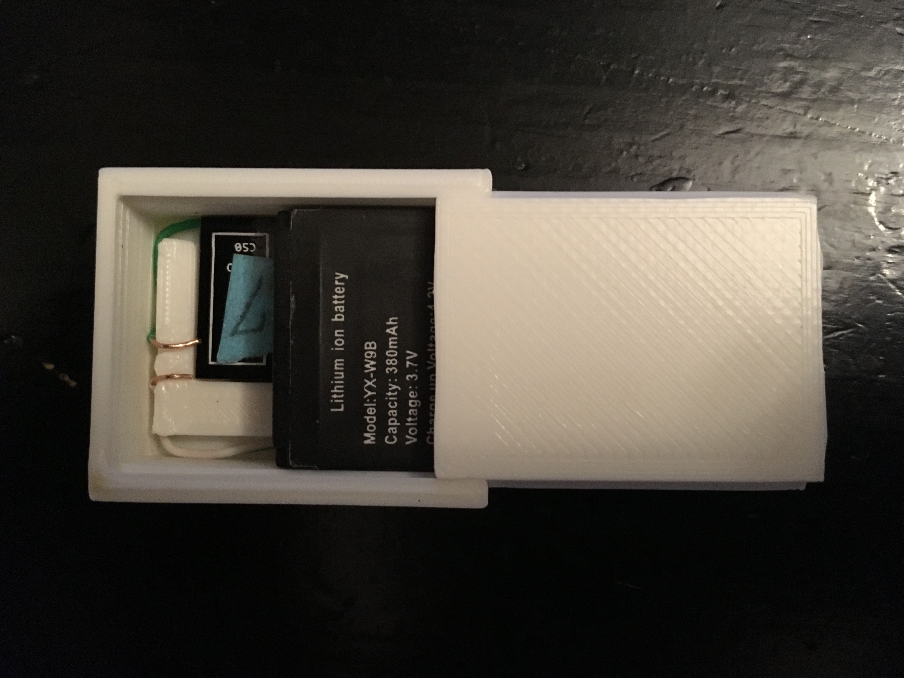
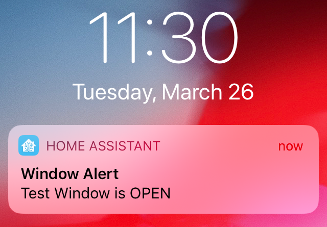

# Incredibly Cheap Wireless Window/Door Sensors

## Overview

This project is intended to provide tools/code/documentation for creating and setting up very cheap window/door sensors. The project will not describe every detail in the process but it will point you to the needed links. The sensors are designed to work within the following parameters.

- Cost under $5 each
- Work seemlessly with home automation software
- Be easy to create and maintain
- Be wireless (Wifi & Battery powered)

## Supplies/Requirements

### Sensor Components

The following components are required to build a single sensor:
- x1 [ESP8266 12E](https://www.aliexpress.com/item/new-ESP8266-Remote-Serial-Port-WIFI-Transceiver-Wireless-Module-Esp-12F-AP-STA/32633529267.html)
- x1 [Normally closed Reed Switch](https://www.aliexpress.com/item/5pcs-Reed-Switch-3-pin-Magnetic-Switch-2-5-14mm-Normally-Open-Normally-Closed-Conversion-2/32947287626.html)
- x1 [3.7v YX-W9B Rechargable Battery](https://www.aliexpress.com/item/1pc-3Pcs-380mAh-SmartWatch-Rechargeable-Li-ion-polymer-battery-For-DZ09-Smart-Watch-Battery-For-KSW/32927626838.html)
- x1 2" insulated small guage copper wire (The twisted pairs of a ethernet cable work perfectly)
- x3 [5mm Magnets](https://www.aliexpress.com/item/32953032626.html?spm=a2g0s.9042311.0.0.7d124c4ddOXJxX)

### Development Components

These following components can be purchased once and used to assemble any number of sensors:

- x1 [USB to TTL adapter](http://a.co/d/hhTu3ec) (Drivers can be found [here]( http://www.prolific.com.tw/US/ShowProduct.aspx?pcid=41&showlevel=0041-0041))
- (Optional, but Highly Recommended) x1 [Breadboard](https://www.aliexpress.com/item/32787386567.html)
- (Optional, but Highly Recommended) x1 ESP to Breadboard Adapter ([Pin Headers](https://www.aliexpress.com/item/86056-Free-Shipping-20pcs-2mm-40-Pin-Male-Single-Row-Pin-Header-Strip/32784910355.html), x2 [Adapter](https://www.aliexpress.com/item/IDE-2-5-to-3-5-inch-Laptop-Hard-Drive-Converter-Adapter/32335319922.html))
    - The Pin Headers fit into the holes on the ESP12E chip
    - The Adapters connect the ESP to the breadboard without needing to solder anything!
- (Optional, but Highly Recommended) x1 [Breadboard & jumper wires](https://www.aliexpress.com/item/3-3V-5V-MB102-Breadboard-power-module-MB-102-830-points-Solderless-Prototype-Bread-board-kit/32697390495.html)

### Software Components

- [ESPHomeFlasher](https://github.com/esphome/esphome-flasher/releases)
- [ESPHome](https://esphome.io)
- [Home Automation Software](https://www.home-assistant.io)

## Building & Testing

The general build process goes like:

1. Flash your ESP8266 with the ESPHome firmware
2. Configure MQTT broker to receive signal from sensor (See [MQTT](###MQTT) Below).
3. Print the enclosure ([Bottom](enclosure/Bottom.stl),[Top](enclosure/Top.stl), [MagnetHolder](enclosure/MagnetHolder.stl)).
4. Assemble & test sensor
5. Repeat setps 1-4 for many more sensors!

### Flash ESP8266 with ESPHome firmware

ESPHome makes programming the esp microcontroller very easy - no Arduino, or sketch programming knowledge is needed. All the configuration is done via simple yaml configurations. We just need to simply follow the ESPHome documentation to assemble a configuration file that will send an MQTT (or other) alert to our home automation software whenever the microcontroller powers on. To install ESPHome Firmware:

1. Follow the ESPHome [Getting Started walkthrough](https://esphome.io/guides/getting_started_hassio.html).
2. Once finished with the initial ESPHome wizard, download the base firmware from ESPHome by clicking on the three dot menu and choosing *compile*, then choosing *Download Binary* once compiling has finished.
3. Flash the ESPHome Binary to the ESP8266 chip using [ESPHomeFlasher](https://github.com/esphome/esphome-flasher/releases)
    - [Wire the ESP12E for flashing mode](http://cdn.srccodes.com/c/2017/02/57/6.png). (It is very helpful to use a breadboard along with the adapter mentioned above (See [image](images/esp8266_flash_wiring.png))
    - Download [ESPHomeFlasher](https://github.com/esphome/esphome-flasher/releases)
    - Flash the downloaded *.bin* firmware to the esp8266 chip using [ESPHomeFlasher](https://github.com/esphome/esphome-flasher/releases).
    - Use the ESPHome web interface to configure and re-flash the esp8266 chip wirelessly. (See [esphome_config.yaml](esphome_config.yaml) for a sample ESPHome config file containing the [Wifi](###WiFi) and [MQTT](###MQTT) configurations explained below.

#### WiFi

The sensor will need to connect to a wifi access point. ESPHome makes this very easy with their [Wifi component](https://esphome.io/components/wifi.html). (See the sample [esphome_config.yaml](esphome_config.yaml) for a sample wifi configuration.)

#### MQTT

The sensor will send an MQTT signal to a specific MQTT topic that is specified in the ESPHome configuration (see the [esphome_config.yaml](esphome_config.yaml) file for a sample MQTT configuration). In order for the sensor to be useful, you will need to configure an MQTT server (broker) to receive the message that will be sent by the sensor. HomeAssistant has a built-in MQTT server that is easy to configure and is the preferred MQTT broker that this project will use. Setup in HomeAssistant is simple:

1. [Setup Homeassistant](https://www.home-assistant.io/getting-started/) & enable the HASSIO [MQTT Add-On](https://www.home-assistant.io/addons/mosquitto/)
2. Test your MQTT broker by using an [MQTT client](https://www.hivemq.com/blog/seven-best-mqtt-client-tools/). From your client MQTT tool, you will just need to make sure you are publishing to the same topic you've specified in your homeassistant setup.

## Print Enclosure
You will need to 3D-Print or [have someone print the enclosure for you](https://lifehacker.com/five-best-3d-printing-services-1706410803). The enclosure consists of the following:

- [The Bottom](enclosure/Bottom.stl) (Holds the ESP8266 chip and the magnetically activated reed switch)
- [The Top](enclosure/Top.stl) (Seals the sensor & holds the battery in place)
- [The Magnet Holder](enclosure/MagnetHolder.stl) (Holds the magnets used to activate the sensor)

Note: If you would like to edit the design of the enclosure, open the [WindowSensorEnclosure.skp](enclosure/WindowSensorEnclosure.skp) file in [Sketchup](https://www.sketchup.com) and submit a pull request if you think the desing is worth sharing!

## Assemble & Test Sensor
Assemble the sensor by completing the following:

- Solder a jumper wire between the *EN* pin and the *VCC* pin on the esp8266
- Solder a jumper wire or bridge the *IO15* pin and the *GND* pin on the esp8266 (See [image](images/esp8266_pre_install.png))
- Solder one end of the reed switch to the *GND* pin of the esp8266
- Solder the copper wire to the *EN* or *VCC* pin of the esp8266
- Place the esp8266 in the bottom of the enclosure and bend the reed switch wire and the copper wire so that the ends sit in the grooves. (This requires a little patience to get the wires situated correctly, but once they are set, they shouln't need to be adjusted again.)
- Insert the battery and confirm that the esp8266 powers on. If it doesn't power on, re-check your wiring and battery voltage.
- Using Homeassistant or an MQTT Client, verify that the MQTT message is being sent on the topic you specified in the ESPHome config.
- Setup [automations](https://www.home-assistant.io/components/automation/) in HomeAssistant to your liking to trigger actions based upon sensor state. While you're at it setup iOS notifications to get notified of state changes on your iPhone and Apple Watch:

## Credits & Inspiration

### ESPHome
[ESPHome](https://esphome.io) made the whole project incredibly easier and more enjoyable. I'm glad I found ESPHome while working on this project! Please check them out and support their work if you can.

### TheHookup
Original inspiration for this project came from [thehookup](https://github.com/thehookup/MQTT_Window_Sensors). His youtube videos below were helpful in visualizing how the sensor could work.
Wireless MQTT Window Sensors with the ESP-01:
Part 1: https://www.youtube.com/watch?v=BoYVr2UwWWg
Part 2: https://www.youtube.com/watch?v=2kLZ7DlP9KU

## Contributions
Any pull requests and/or improvements would be greatly appreciated.

## License
[MIT Licnese](license.txt)
